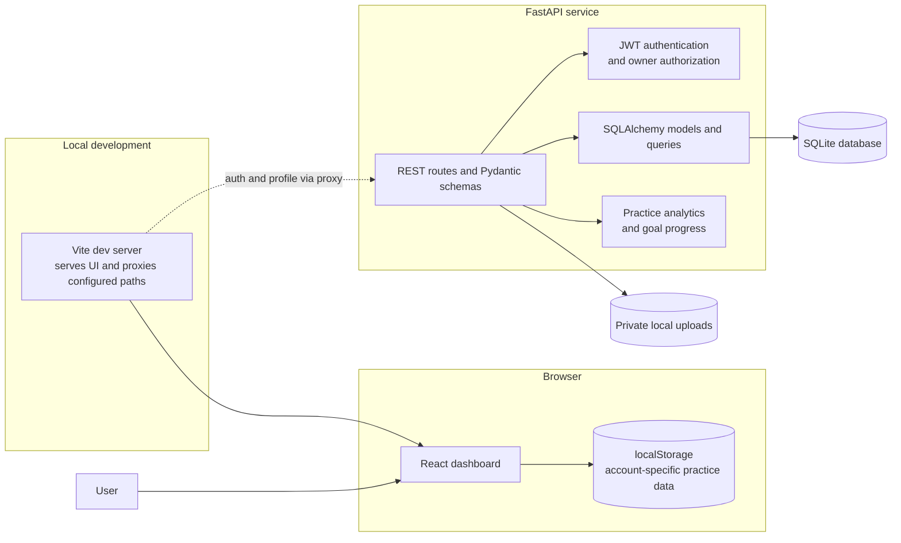
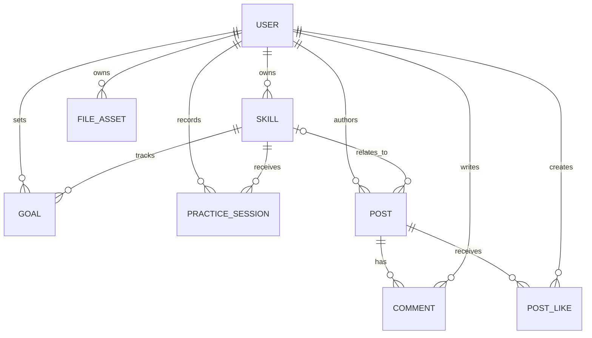

# 🎯 Online-Cloud-Hobby & Skills Tracker with Community Sharing

A local-first hobby and skills tracker with a polished React dashboard and an independently runnable FastAPI REST service. It demonstrates the practice-to-progress loop, social sharing, user-scoped APIs, JWT authentication, relational data, and private file handling without requiring a paid cloud account.

> **Project status:** users sign up and sign in through the FastAPI service. The dashboard has no seeded Jordan Lee account or fictional starter activity; each account starts with an empty workspace. Practice records are currently stored in browser `localStorage`, isolated by API account ID, and are not synchronized to the API. The API separately supports persistent, owner-scoped resources in SQLite and private local uploads. Firebase/AWS hosting and managed object storage are deployment directions, not configured live services.

## Features

- Create skills and goals, log sessions, and see streaks, weekly time, and goal progress update.
- Share community updates, attach a small image, like posts, and leave comments.
- Sign up and sign in with a FastAPI API using hashed passwords and expiring bearer tokens.
- Keep each signed-in account's dashboard workspace separate in the current browser.
- Create skills and goals, log practice, and share updates in the browser-local dashboard.
- Use the API directly for owner-scoped skills, goals, practice sessions, posts, comments, likes, and image files.
- Calculate dashboard analytics from practice records and update linked goals transactionally.
- Run automated API tests with a temporary SQLite database and synthetic users.
- Explore REST documentation at `/docs` after starting the API.

## 🏗️ Project Architecture

### System Overview

The repository contains a React dashboard and a separately usable REST API. The dashboard calls the API for registration, login, and profile verification, but practice workspace records are not yet synchronized with API resources. The Vite development server proxies `/api` and `/health` to FastAPI.



### Components

| Component | Responsibility | Current implementation |
|---|---|---|
| Dashboard | Render skills, practice, goals, and community activity; calculate metrics and persist workspace data by account | React 19, Vite, browser `localStorage` |
| Authentication | Register, sign in, verify the current profile, and retain the short-lived bearer token | FastAPI auth routes; token stored in browser `localStorage` |
| Development/build server | Serve the dashboard, build static assets, and proxy API paths during development | Vite; `/api` and `/health` target `127.0.0.1:8000` |
| REST API | Validate requests, authenticate users, enforce resource ownership, and return JSON | FastAPI, Pydantic schemas, bearer JWTs |
| Persistence | Store accounts, skills, goals, sessions, posts, comments, likes, and upload metadata | SQLAlchemy with SQLite by default; database URL is configurable |
| File storage | Store uploaded image bytes separately from their database metadata | Local `uploads/` directory; private unless explicitly made public |
| Tests and CI | Exercise API behavior and check frontend lint/build | Pytest, Oxlint, and GitHub Actions |

### Data Model



The API schema uses integer primary keys and foreign keys. Private records carry an owner ID so API queries can constrain reads and writes to the authenticated account. A uniqueness constraint on `(post_id, owner_id)` prevents duplicate likes. Post visibility is explicit; a public post does not automatically make its attached file public.

### Data Flows

1. **Account access:** Sign-up and sign-in forms send credentials through the Vite `/api` proxy. The API hashes passwords with Argon2 and returns a time-limited JWT with the user profile. On reload, the dashboard verifies the token against `/api/profile`.
2. **Dashboard workspace:** Each account starts with empty skills, sessions, goals, and posts. The dashboard saves changes in browser `localStorage` under keys scoped to that account ID. These dashboard records are not sent to the API and are not shared across browsers.
3. **Owned API operations:** API clients send the JWT as a bearer token. FastAPI validates request bodies with Pydantic, resolves the token to a user, and scopes private database queries to that user's ID. Community endpoints expose only explicitly public posts.
4. **Practice and analytics:** API practice sessions must reference a skill owned by the same user. Inserting a session and incrementing matching active goals happen in one database transaction; API analytics aggregate database-backed practice history and goal state.
5. **Image uploads:** The API checks allowed image types, file signatures, and the 5 MB size limit. It stores image bytes on disk under a generated name and stores ownership and metadata in SQLite. Reading a private file requires an authenticated owner.

### Runtime and Deployment Boundaries

| Concern | Local/demo behavior | Production direction |
|---|---|---|
| Frontend | Vite serves the React app; production build is static files in `dist/` | Static hosting behind a CDN |
| API | FastAPI runs as a separate process on port 8000 | Managed container or serverless service behind HTTPS ingress |
| Database | SQLite file at `hobby_tracker.db` by default | Managed PostgreSQL or a deliberately designed document database |
| Media | Private files in local `uploads/` | Private object storage with ownership checks and short-lived signed URLs |
| Identity | API-local password verification and signed JWT; browser retains the token in `localStorage` | Managed identity provider or a hardened API identity service |
| Secrets | `.env` is local and gitignored; `.env.example` contains placeholders | Platform secret manager; never expose signing secrets in frontend assets |
| Observability and recovery | Health endpoint and application logging; no automated backup | Structured logs, metrics, alerts, database backups, and object lifecycle/versioning |

The cloud options in this project are design directions, not provisioned services. Firebase, AWS, and Azure mappings, threat boundaries, and scaling notes are in [docs/architecture.md](docs/architecture.md). API routes and request/response contracts are in [docs/api-reference.md](docs/api-reference.md). Do not describe the dashboard's practice records as synchronized with the API until shared persistence is implemented.

## Security Notes

- Passwords are Argon2-hashed; API tokens expire and are sent in the `Authorization: Bearer` header.
- Every private resource query is scoped to the authenticated owner. Community access is explicitly public-only.
- Uploads allow only JPEG, PNG, WebP, and GIF up to 5 MB; private files require an authenticated owner to read.
- Secrets, local databases, uploaded media, and virtual environments are excluded from Git.
- SQLite/local disk is for a course demo, not a horizontally scaled production deployment. Use managed identity, a managed database, and private object storage with signed URLs before public launch.

## Cloud Deployment Direction

For a student deployment, host the built frontend on Firebase Hosting, the API on a free-tier container platform, and replace SQLite/local disk with managed PostgreSQL plus private object storage. A Firebase-native variant can use Firebase Auth, Firestore, Storage, Hosting, and Cloud Functions. Do not deploy the local fallback signing key or expose private uploads.

## Repository Layout

```text
src/                 React dashboard and styles
backend/app/         FastAPI routes, SQLAlchemy models, schemas, and security
backend/tests/       API integration tests
docs/                Architecture and API contracts
reports/             Course project report
screenshots/         Captured app proof
requirements.txt     Python dependencies
package.json         Frontend scripts and dependencies
```

## Summary

Built a local-first hobby and skills tracker with React, FastAPI, SQLite, JWT authentication, owner-scoped REST APIs, local object uploads, community interactions, and progress analytics. Designed the architecture to map to managed cloud services while keeping the course demonstration executable without paid infrastructure.

## 👨‍💻 Author
Shresthaa Maiti
