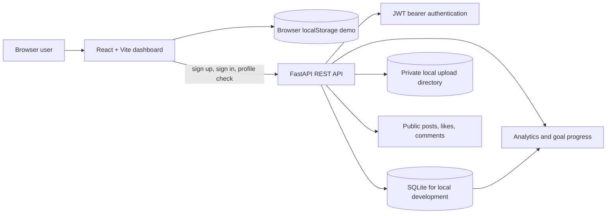

# Architecture and Cloud Computing Notes

## System Shape



The dashboard authenticates users through the API, while practice workspace state remains in browser `localStorage` and is not synchronized with API records. New accounts start with an empty dashboard rather than synthetic sample activity. The API is an independently usable REST service with database persistence and owner-scoped authorization; Vite proxies its auth and profile requests during development.

## Data Model

```text
User 1 ── * Skill 1 ── * PracticeSession
User 1 ── * Goal * ── 1 Skill
User 1 ── * Post 1 ── * Comment * ── 1 User
User 1 ── * PostLike * ── 1 Post   (unique post_id + owner_id)
User 1 ── * FileAsset
```

SQLite primary keys are integer IDs. Foreign keys define ownership relationships; owner IDs are included in private lookups. Indexes support user, date, feed, and interaction queries. Likes have a uniqueness constraint to prevent duplicate rows.

## Cloud Concepts In This Project

| Concept | Current demonstration | Production direction |
|---|---|---|
| SaaS / client-server | Browser dashboard and JSON API | Host frontend and API as managed services |
| Authentication | Argon2 password hashes and expiring JWTs in FastAPI | Firebase Auth, Cognito, Entra External ID, or Supabase Auth |
| Authorization | `owner_id`-scoped SQL queries and public feed checks | Database policies plus API-side checks |
| Cloud database | Local SQLite exercises relational design; it is not a cloud DB | Managed PostgreSQL or Firestore |
| Object storage | Local `uploads/` storage with private-by-default access | S3, Firebase Storage, Azure Blob, or Supabase Storage |
| REST API | FastAPI routes with JSON schemas, status codes, and OpenAPI docs | API Gateway or managed ingress in front of services |
| Serverless / events | Not deployed; goal updates happen in the practice request transaction | Queue-triggered Functions for badges, recaps, and notifications |
| CDN / load balancing | Not part of local execution | CDN for static assets/media and managed ingress for API traffic |
| Caching | Not needed for the small local data set | Cache public feed summaries with explicit invalidation/TTL |
| Observability | Python logging and health endpoint | Structured logs, metrics, traces, alerts, and audit events |
| Backup | No automatic local backup | Managed database snapshots and object versioning/lifecycle rules |
| CI/CD | Scripts are ready for a GitHub Actions workflow | Build, test, scan, then deploy immutable artifacts |
| Secrets | `.env` is gitignored; `.env.example` contains placeholders only | Platform secret manager, never frontend variables |

## Data Flow

1. A user registers or signs in; the API verifies credentials and returns a short-lived bearer token.
2. The client attaches that token to private requests. The API resolves the user before accessing user-owned data.
3. Skill and goal writes are validated by Pydantic. Practice logs validate the skill belongs to the same user.
4. Practice insertion and associated active-goal increments are committed in one database transaction.
5. Dashboard analytics aggregate owned sessions, goal states, streak dates, and engagement counts.
6. Public posts are paginated; likes are idempotent and comments are attributable to their author.
7. Uploaded image metadata is stored in SQLite; bytes live separately. Private files require owner authorization.

## Storage and Privacy

The database stores file metadata and a stable file ID, not image bytes. The local API generates random storage names and never trusts a user-provided filesystem path. Public feed visibility does not make a private file public. Before a post can expose media, production code must verify file ownership and create an explicit public attachment or short-lived signed URL.

The demo includes synthetic people and posts only. Do not add real student data, credentials, private photos, or tokens to a public repository. Provide account deletion and retention policies before onboarding real users.

## Scale and Failure Design

- **10 users:** SQLite and local uploads are sufficient for local demos; keep backups manually.
- **1,000 users:** move to managed PostgreSQL and object storage; add pagination, indexes, request limits, and monitoring.
- **100,000 users / million posts:** horizontally scale stateless API instances, use a CDN for public media, queue derived analytics, and cache feed pages.
- **Feed fan-out on read:** fetch posts when a user opens the feed; simpler writes, more work per read.
- **Feed fan-out on write:** copy new post references into follower feeds; faster reads, higher write cost and harder consistency for accounts with many followers.

Retries should be bounded and use idempotency keys for non-idempotent writes. Upload metadata failure triggers object cleanup. A production migration should use managed database transactions, durable queues, retry policies, and alerts rather than in-process background work.

## Cloud Options

- **Student-friendly:** Firebase Hosting + Firebase Auth + Firestore + Firebase Storage. The current FastAPI schema would be replaced by Firestore repositories or retained behind Cloud Run; configure Security Rules and Storage Rules before public access.
- **Container route:** static frontend on Firebase Hosting/Cloudflare Pages, FastAPI container on a free-tier host or Cloud Run, managed PostgreSQL, and private object storage. Verify each provider's current free quota and region availability before deployment.
- **AWS reference:** CloudFront + S3 static hosting, Cognito, API Gateway, Lambda or App Runner, RDS/DynamoDB, private S3 media, CloudWatch, and Secrets Manager.
- **Azure equivalents:** Static Web Apps, Entra External ID, API Management/Functions or Container Apps, Azure Database for PostgreSQL/Cosmos DB, Blob Storage, Monitor, and Key Vault.
- **Google Cloud equivalents:** Firebase Hosting/Identity Platform, Cloud Run or Cloud Functions, Cloud SQL/Firestore, Cloud Storage, Cloud CDN, Cloud Logging/Monitoring, and Secret Manager.

These are target architectures; this repository does not create cloud resources or contain provider credentials.
